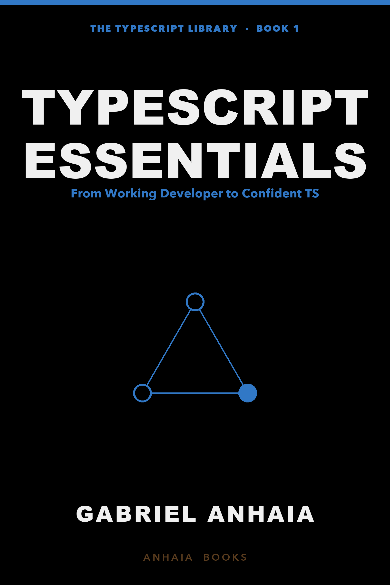
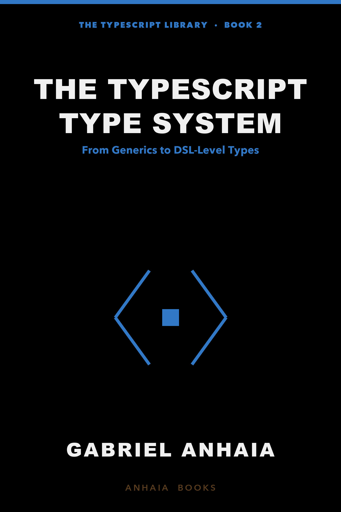
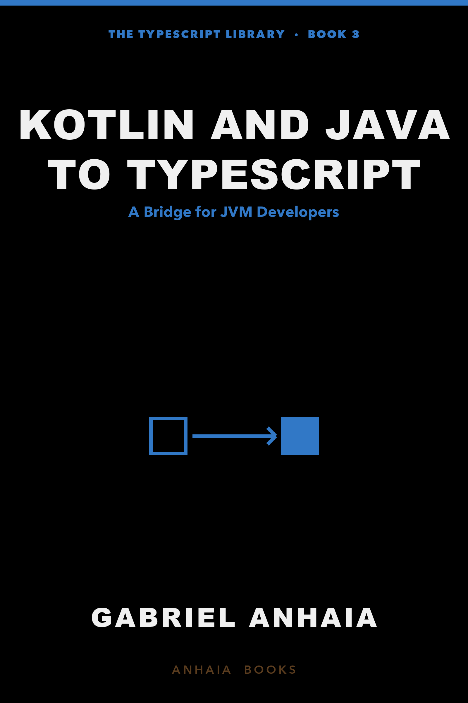
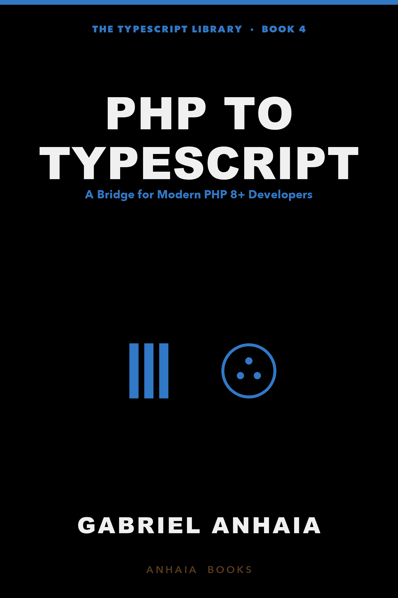

# The TypeScript Library — Code Examples

Runnable, CI-verified code examples that accompany the books in
**_The TypeScript Library_** by Gabriel Anhaia.

<p align="center">
  <a href="./typescript-essentials"></a>&nbsp;
  <a href="./typescript-type-system"></a>&nbsp;
  <a href="./jvm-to-typescript"></a>&nbsp;
  <a href="./php-to-typescript"></a>
</p>

The books themselves live in private repositories; the code on this
public repo is everything the chapters reference. Every example is
type-checked, linted, formatted, and tested in CI on every push.

## The four books

| Book                                       | Examples folder                                       | Audience                                                                                        |
| ------------------------------------------ | ----------------------------------------------------- | ----------------------------------------------------------------------------------------------- |
| **Book 1 — TypeScript Essentials**         | [`typescript-essentials/`](./typescript-essentials)   | Working developer becoming confident in TS across Node, Bun, Deno, and the browser              |
| **Book 2 — The TypeScript Type System**    | [`typescript-type-system/`](./typescript-type-system) | TS user who wants generics, mapped types, conditional types, and the rest of the type machinery |
| **Book 3 — Kotlin and Java to TypeScript** | [`jvm-to-typescript/`](./jvm-to-typescript)           | JVM developer (Kotlin-led, Java-aware) crossing to TypeScript                                   |
| **Book 4 — PHP to TypeScript**             | [`php-to-typescript/`](./php-to-typescript)           | Modern PHP 8+ developer (Laravel/Symfony) crossing to TypeScript                                |

Each subfolder is an independent npm project with its own `package.json`,
`tsconfig.json`, and CI script. Read the per-folder `README.md` for the
chapter-by-chapter map of what's inside.

## Quick start

```bash
git clone https://github.com/gabrielanhaia/the-typescript-library-examples.git
cd the-typescript-library-examples/<book-folder>
npm install
npm run ci
```

`npm run ci` runs the same pipeline GitHub Actions runs on every push:

```text
typecheck → lint → format:check → test
```

If a chapter's code doesn't behave as the book describes, **the code in
this repo is the source of truth**. Open an issue with the chapter
reference and the failure, and the next revision pulls in the fix.

## Versions pinned

All four books target the same toolchain:

| Tool              | Version                                                 |
| ----------------- | ------------------------------------------------------- |
| TypeScript        | **6.0.x** (March 2026)                                  |
| Node.js           | **24 LTS** (active) — also tested on 22 LTS and 25      |
| Bun               | **1.3.x**                                               |
| Deno              | **2.7.x**                                               |
| Vitest            | **4.x**                                                 |
| ESLint            | **10.x**                                                |
| typescript-eslint | **8.x**                                                 |
| Prettier          | **3.x**                                                 |
| Biome             | **2.2.x** (Book 1 only; the rest use ESLint + Prettier) |
| Zod               | **4.x**                                                 |

Each `package.json` pins these. When a new major lands, the per-book
README calls out what changed.

## Repository layout

```text
the-typescript-library-examples/
├── README.md                       ← you are here
├── LICENSE                         ← MIT
├── .github/workflows/ci.yml        ← runs npm run ci per book on every push
├── typescript-essentials/          ← Book 1 (28 chapters)
├── typescript-type-system/         ← Book 2 (25 chapters)
├── jvm-to-typescript/              ← Book 3 (27 chapters)
└── php-to-typescript/              ← Book 4 (27 chapters)
```

## Contributing

- **Found a bug in the code?** Open an issue with the book and chapter
  reference, the shortest reproducer, and the runtime version you're on.
- **Found a bug in the book that the code disagrees with?** Same thing —
  the repo is the source of truth, and the book follows.
- **Pull requests welcome** for fixes. New patterns or new examples
  beyond what the chapters cover are out of scope; this repo mirrors the
  books, not extends them.

## License

MIT. See [LICENSE](./LICENSE).

## About the books

The books are published as **_The TypeScript Library_**, a five-book
collection. Books 1–4 are shipped; Book 5 (_TypeScript in Production_)
is in progress. When Book 5 ships, its examples folder lands here as a
fifth subfolder.
